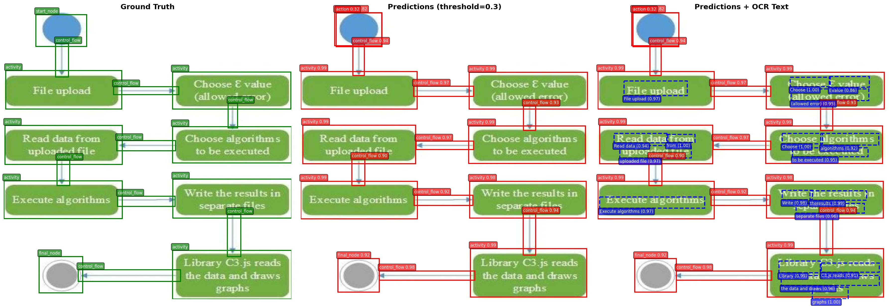

# Diagram Decomposer

Faster R-CNN (Fine-tuned on diagram datas: Francesco/activity-diagrams-qdobr) + Paddle OCR



## Usage

### Training

```bash
python train_od.py --epochs 20 --batch-size 4
```

### Testing with OCR

```bash
python test_od.py --enable-ocr --num-vis 10
```
